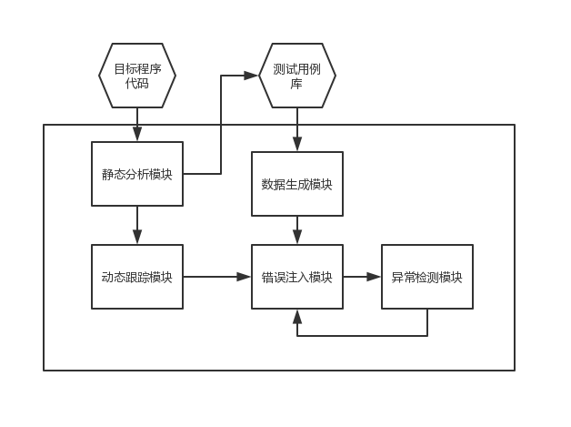
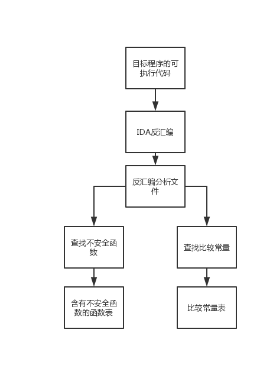
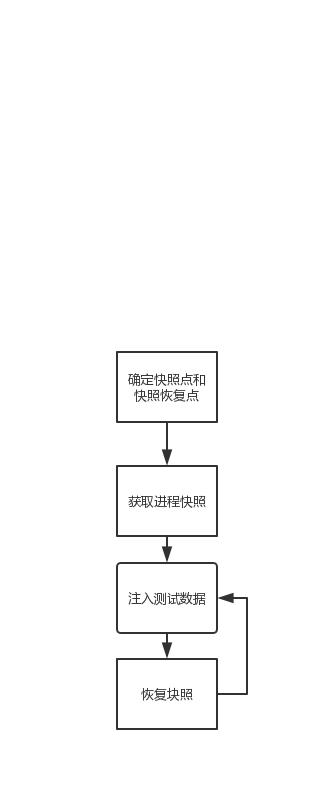

#  基于模糊测试的软件安全漏洞技术挖掘

##  关键技术

###  1.不安全函数定位技术

不安全的函数由于没有做任何的越界检测，主要是容易被溢出。

这些函数有：

|                  函数名                  | 不安全性                                                     |
| :--------------------------------------: | ------------------------------------------------------------ |
|      strcpy、wcscpy、strct、lstrcat      | 不检查目标缓冲区的大小，也不检查null或者其他无效指针         |
|  strncpy、wcscpy、_lstrcpyn、__mbsnbcpy  | 不能保证会用null来结束目标缓冲区，也不检查null或其他无效指针 |
|            memcpy、CopyMemory            | 目标缓冲区必须不小于源缓冲区，否则易造成缓冲区溢出           |
|                 printf类                 | 可能导致格式化字符串类缓冲区溢出漏洞                         |
| sprintf、swprintf、_snprinff、_swnprintf | 不能保证会用null结束目标缓冲区                               |
|                   gets                   | 不检查复制的缓冲区大小                                       |

 #####  不安全函数：

普通函数调用的方式，采用了call指令完成对不安全函数的调用

- 通过判断程序代码中是否存在调用这些函数的指令来进行的

  (1)从二进制代码起始处读取指令

  (2)判断指令的操作码是否为“call”，是就转(3)，否则转(5)

  (3)判断"call"指令的操作数是否为不安全函数列表中的函数名，是则转（4），否则转（5）

  (4)记录该“call”指令所在的内存地址和其调用的不安全函数名称

  (5)读取下一条指令，成功则转(2),否则结束

采用函数固有形式

- 通过判断代码中是否存在符合不安全函数展开形式的特征的指令序列来完成的
  - 顺序读取代码中每条指令，当找到第一条关键指令后，在两条关键指令可能间隔得最大范围内依次读取指令，进行第二条关键指令得匹配，若匹配成功则依此继续匹配下一条关键指令，如此进行下去，直到所有指定得关键指令都匹配成功为止。如果在此过程中有一条关键指令无法匹配，则此识别失败。

### 2.基于输出入和函数调用的动态追踪技术

安全漏洞成因：

- 来自外部的用户输入
- 程序内部对不安全函数的调用

#### 输入数据截取

获得外部输入数据在内存中的存储地址。

#### 监控处理输入数据的函数

关注对输入数据进行操作且存在有对不安全函数调用的函数

### 3.基于漏洞类型和代码覆盖的模糊数据生成技术

#### 基于漏洞类型的模糊数据生成

- 模糊数据的生成关系到了测试的可行性和效率高低。需要选择一个具有潜在漏洞可能的特定数值得子集。

- 针对缓冲区溢出漏洞，最常见得就是选取各种长度得超长字符串来生成测试数据。最好不要用重复A得超长字符串。

- 测试用例中还应该包括非字母字符，列如空格、制表符等。
- 当生成模糊字符串时，很重要得就是生成不同字段分隔符得长字符串。
  - ！@##%￥%*&）&（——（===——+

####  基于代码覆盖得测试数据生成

获得源代码，并在代码中插入附加代码以获取代码覆盖信息。

### 4.基于快照恢复的错误注入技术

选取具有正确格式的输入数据样本以通过软件相关检测函数的验证，在执行到真正对数据进行应用的相关解析函数时，设置错误注入点，保存此时的进程快照（包括线程的上下文环境和内存数据），接着改变调用参数为生成的测试用例，再在函数的结束处设置还原点，接着继续运行并检测程序的运行状况，若无异常，则当程序运行到还原点时挂起进程，将进程环境恢复为错误注入点处保存上下文内容，重新进行错误注入，直到程序发生异常或测试用例耗尽。

## 实现

### 环境：

针对：windows系统下的二进制可执行文件

语言：python

### 模糊测试基本过程

（1）确认测试对象和输入向量

（2）生成模糊测试数据

（3）执行模糊测试数据

（4）监测异常

### 基本工作流程

首先利用反汇编工具将目标软件的可执行代码反汇编为汇编代码，再通过静态分析程序的汇编代码确定各函数块的位置，并查找不安全函数的调用地址，以及查找代码中比较指令引用的常量数据以指导生成测试用例；之后通过对输入点函数的确定和监控，实现对输入数据的动态截获，接着动态跟踪输入数据的使用，以确定快照点（错误注入点）和快照恢复点；在快照点保存进程快照，当程序执行到快照恢复点时，恢复之前保存的快照进程，既进程状态又回到快照点（错误注入点）时状态，将数据生成模块生成的测试用例注入内存中运行，若程序无异常发生则又来到快照恢复点重新进行快照恢复并注入新的模糊测试数据，依此循环下去；若发生异常则异常检测模块会检测到并记录下异常相关信息。

##### 静态分析模块

利用反汇编工具IDApro，生成相应的汇编代码

利用IDA脚本语言IDApython编写的脚本自动分析和确定程序的各函数块

用分析结果识别并查找代码中不安全函数调用的位置以及所在的函数。

搜索代码中的决策分支处所比较的常用变量，用以建立测试用例库。

##### 动态跟踪模块

在PyDbg（一个用python编写的win32调试抽象类）的基础上建成

##### 错误注入模块

