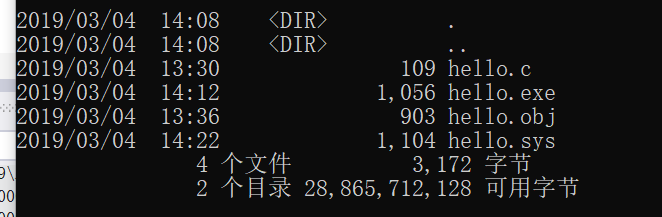
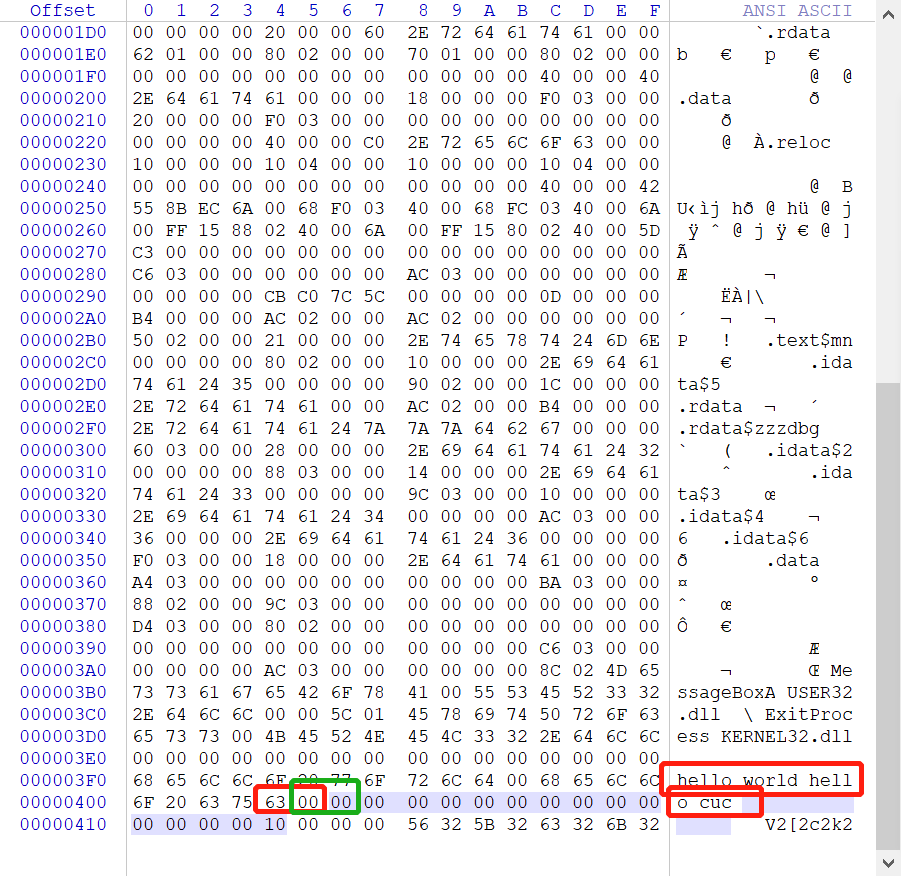
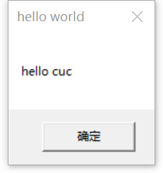
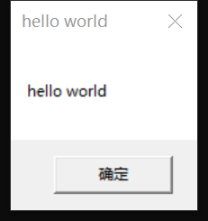

# 1、编写一个release版本的 hello world 程序。通过修改程序可执行文件的方式（不是修改源代码），使得程序运行后显示的内容不为hello world，变成 hello cuc！
提示：一定要在编译选项中将调试信息相关的编译连接选项去掉，否则程序体积会比较大，而且存在很多“干扰”信息。

### 实验步骤

1.写一个hello.c文件

```c
#include<Windows.h>
int main() {
	MessageBox(NULL,"hello world","hello world", MB_OK);
	ExitProcess(0);
    //如果不加这个，程序会一直执行，程序不结束就不能够在winhex中打开
}
```

2.打开vs 2017的开发人员命令行提示符

```
cl /c /o1 hello.c
#cl是编译
link  user32.lib kernel32.lib /nologo /entry:main /driver /nodefaultlib /subsystem:windows /align:16 hello.obj
```

3.然后我们就能在目录下看到生成了obj和exe文件



4.用winhex打开生成的hello.exe,修改图中的hello world为hello cuc，将多余的字符部分改为空就好。



5.运行修改后的exe，和之前未修改之前的进行对比。

- 修改后

  

- 修改前

