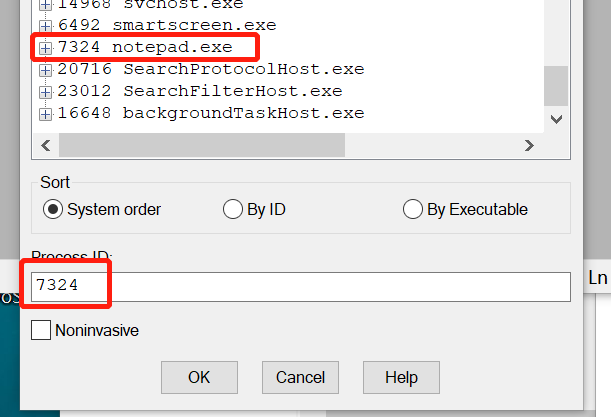
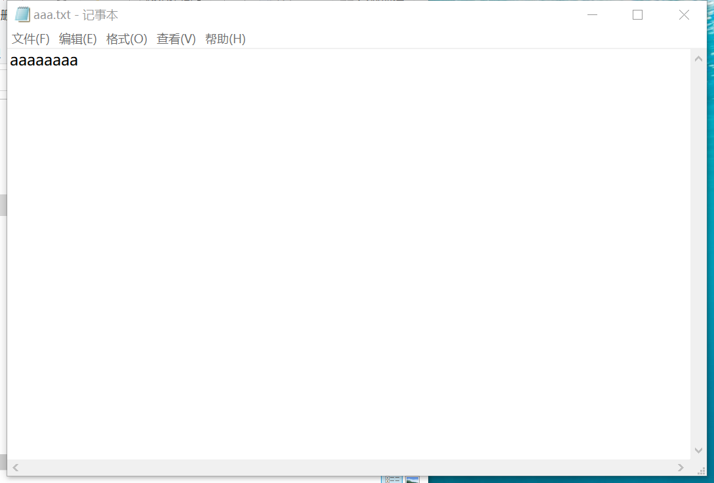
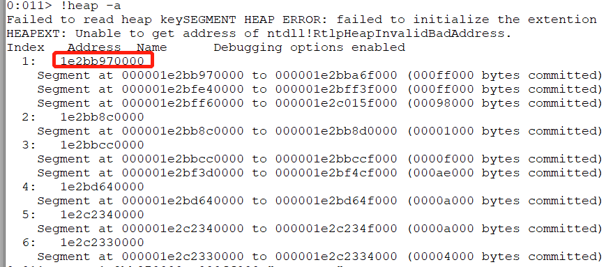
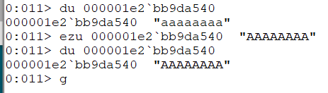
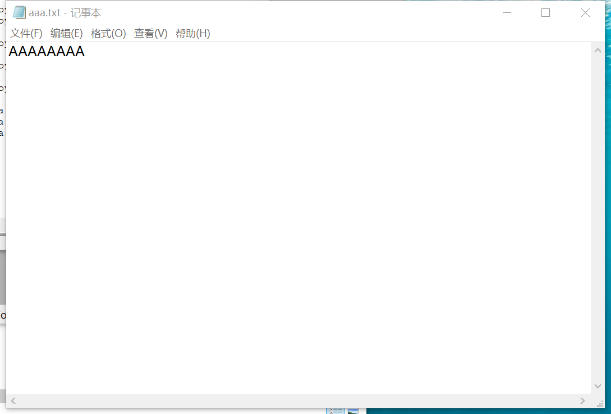

# 3、在notepad（32位64位均可）中，输入一段文字。然后使用调试器，在内存中修改这段文字。使得没有在界面操作notepad的修改文字的情况下。notepad中显示的文字变化。
提示，在调试器中定位控件缓存的内存地址，可以用搜索、逆向、消息截获分析、API截获分析等方法。

软件是数据和对数据的操作的集合。
软件安全就是研究软件的操作的具体过程、数据的具体形式，然后想办法获得、修改、破坏或者实施隐藏。又分为攻和防两个方面。
底层的软件，一次操作所能影响的数据少，操作的逻辑简单。
越到高层，一次操作所能影响的数据越多，操作的逻辑越复杂。
例如指令 -> C语言语句 -> 函数 -> 对象汇编 -> C -> C++ -> 各类脚本。所以，我们进行软件攻防也有两种基本的方法。   hook 和 DKOM   
hook，挂钩，即找到程序中的原有代码，并修改其代码，增加、减少或者篡改原用功能。达到授权破解（keygen）、作弊（游戏外挂）、隐藏（隐蔽攻击痕迹防止被防御软件查杀）等目的。   
DKOM，直接内核对象操作。是一种典型的直接对程序内部数据的攻击。

### 实验步骤

1.通过windbug来进行notepad进行附加。

通过 ```file-attach to process(F6)```来打开notepad.exe。



2.通过指令对txt文件进行修改。

我们现在看到的文件内容是这样的



然后进行下列命令找到所有的栈堆

````
!heap -a
````



然后查找第一个地址中的字符串


通过上面的第一个地址，我们可以对此进行修改。

```
# 修改字符串
ezu 000001e2`bb9da540 "AAAAAAAA"

# 显示Unicode
du 000001e2`bb9da540

# 继续运行程序
g
```




然后我们就能看到修改后的结果。

