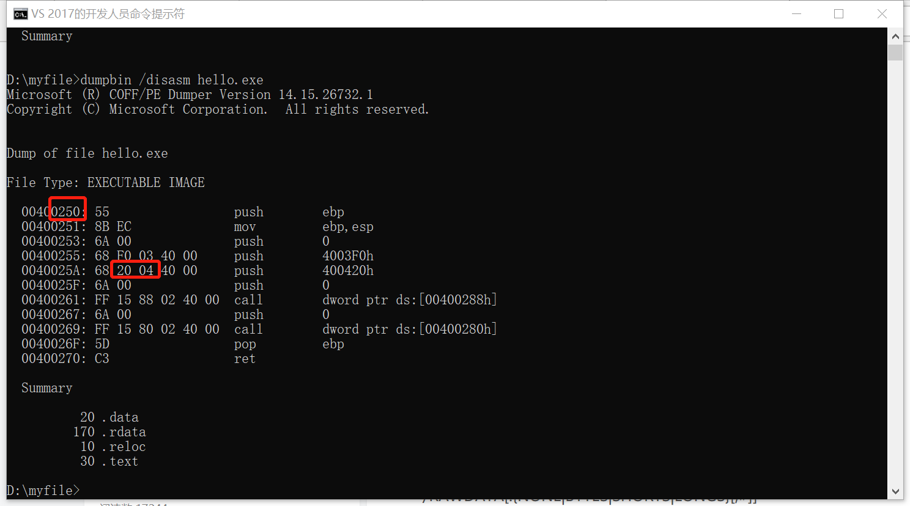
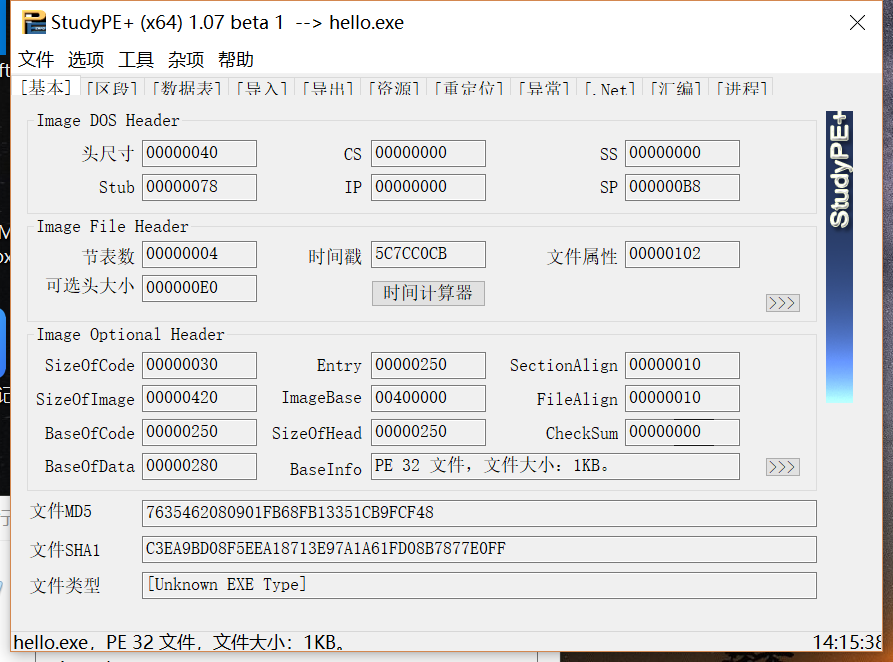
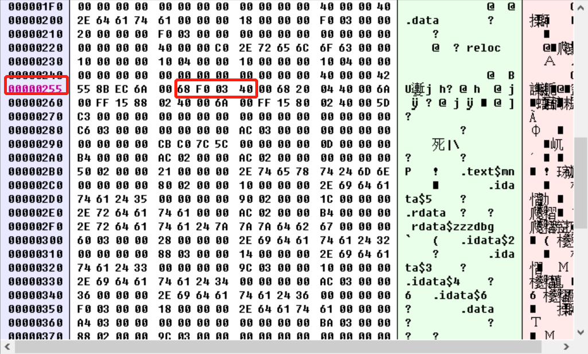
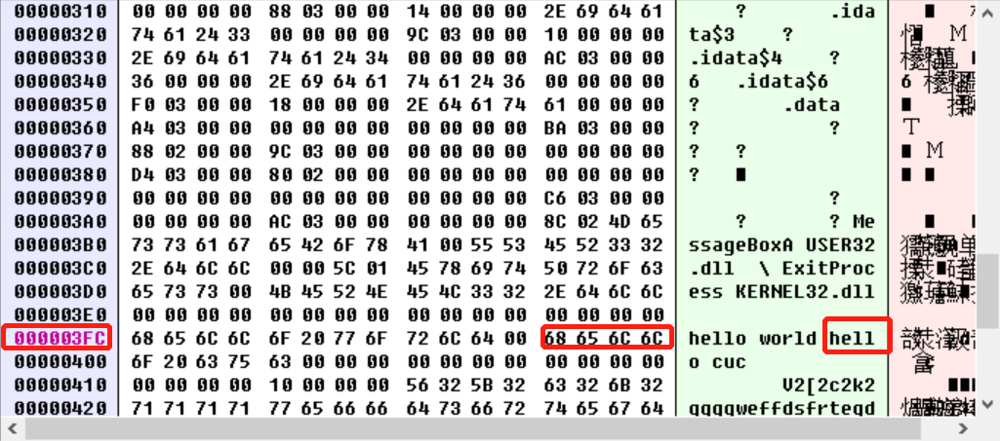
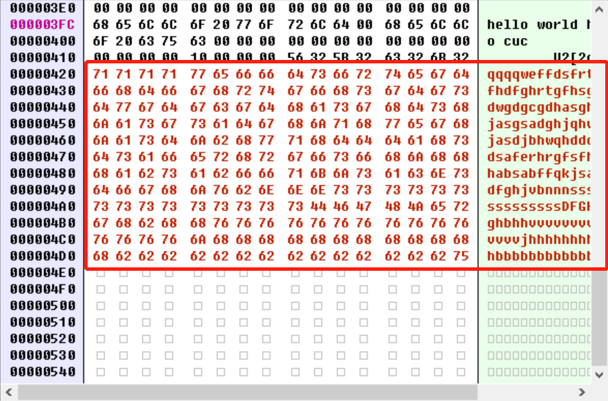
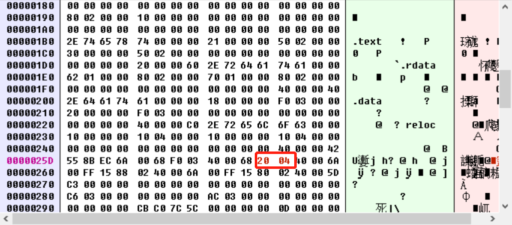
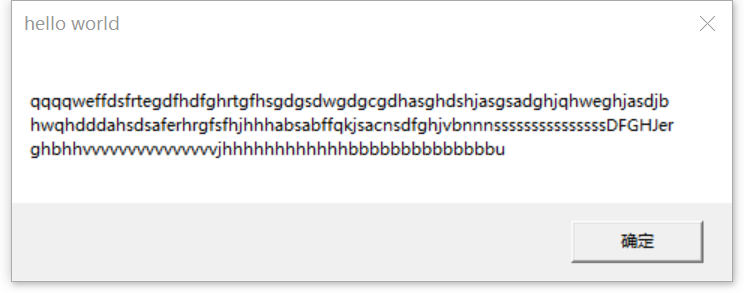

# 2、上一题的程序中，修改的显示内容变为一个很长的字符串（至少2kb长）。并且保证程序正常运行不崩溃。
提示，可执行文件中原有的空间有限，必须要新加入数据，加入数据后必须要修改.text字段中的指针。

### 实验步骤

1.找到函数入口

```
#使用如下指令打开反汇编的函数信息
dumpbin /disasm xxx.exe
```

从下图我们可以看到函数的入口为250



如果还需要确认，我们可以StudyPE+来确认PE文件的详细信息。



2.用二进制文件打开生成的exe，找到函数中显示内容的地址。

结合上面反汇编的信息我们可以知道要显示的地址为03F0



3.我们可以从03F0中找到我们原来显示的内容为hello cuc。



4.在文件的末尾加上想要显示的内容。



5.将上面原来显示hello cuc那里的地址改为增加的字符的始地址。



6.修改保存后，打开修改后的exe就能看到如下结果。

